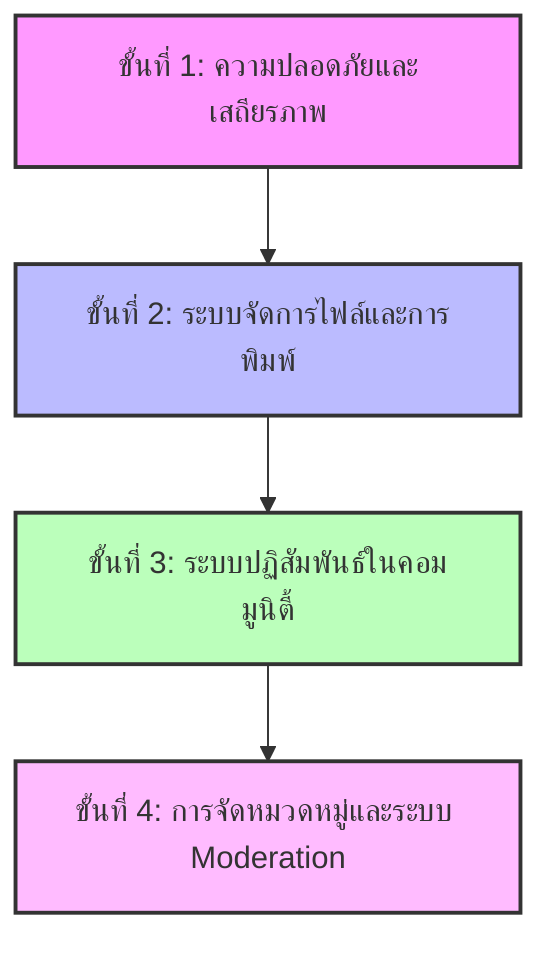

# รายงานผลการตรวจสอบความสมบูรณ์ของระบบ IT.FORUM (System Completeness Audit Report)

จากการตรวจสอบโครงสร้างซอร์สโค้ดและระบบปัจจุบันของ **IT.FORUM** ทั้งในส่วนของ **Backend (Express + Drizzle ORM + PostgreSQL)** และ **Frontend (Vue 3 + Vite + TailwindCSS v4 + Pinia)** ทางทีมงานได้สรุปสถานะการพัฒนา คุณสมบัติที่มีอยู่แล้วในปัจจุบัน และส่วนที่ยังขาดตกบกพร่องซึ่งจำเป็นต้องได้รับการพัฒนาเพิ่มเติมเพื่อให้ระบบสมบูรณ์และพร้อมใช้งานจริงในระดับ Production ดังนี้ครับ

---

## 1. ภาพรวมคุณสมบัติที่มีอยู่แล้วในปัจจุบัน (Current Features)

ปัจจุบันระบบมีโครงสร้างพื้นฐานที่ดีและมีสถาปัตยกรรมแบบแยกส่วน (Modular) ที่ชัดเจน ได้แก่:

*   **ระบบผู้ใช้งาน (User & Authentication):**
    *   การลงทะเบียนและเข้าสู่ระบบด้วยอีเมล/รหัสผ่านปกติ (Local Auth) เข้ารหัสผ่านด้วย bcryptjs
    *   การเข้าสู่ระบบผ่าน Google Sign-In (Social OAuth 2.0)
    *   ระบบสิทธิ์การใช้งานเบื้องต้น (Role: `user` และ `admin`)
    *   การเก็บสถานะการเข้าสู่ระบบและอัปเดตข้อมูลผู้ใช้งาน (Pinia + LocalStorage + JWT)
    *   หน้าแก้ไขข้อมูลส่วนตัวและเปลี่ยนรูปภาพโปรไฟล์ (ผ่าน URL)
*   **ระบบห้องสนทนาและกระทู้ (Forums & Threads):**
    *   การสร้าง แก้ไข และลบห้องสนทนา (Forums) - จำกัดสิทธิ์เฉพาะผู้สร้างหรือผู้ดูแลระบบ (Admin)
    *   การเปิดกระทู้ใหม่ (Threads) ภายใต้ห้องสนทนาต่างๆ
    *   การตอบกลับความคิดเห็น (Posts) ในแต่ละกระทู้
    *   ระบบการแก้ไขและลบกระทู้/ความคิดเห็นของตนเองหรือสิทธิ์ Admin พร้อม Modal ยืนยันการลบ
    *   ระบบแบ่งหน้า (Pagination) สำหรับกระทู้และความคิดเห็น
*   **ระบบค้นหา (Search System):**
    *   ค้นหาห้องสนทนาและกระทู้พร้อมกันแบบ Real-time โดยใช้คำสั่ง SQL `ILIKE`
*   **โครงสร้างและการทำงานพื้นฐานอื่นๆ:**
    *   การสร้างฐานข้อมูลจำลอง (Mocking capabilities) และการกำหนดเมล็ดพันธุ์ข้อมูลเริ่มต้น (Database Seeding)
    *   การใช้งาน Docker Compose สำหรับการจำลอง PostgreSQL Database 16-alpine ในเครื่องนักพัฒนา
    *   การป้องกันข้อผิดพลาดพื้นฐานผ่าน Global Error Middleware ใน Backend และ Zod สำหรับตรวจสอบความถูกต้องของข้อมูลนำเข้า (Data Validation)

---

## 2. สิ่งที่ระบบยังขาดอยู่เพื่อให้สมบูรณ์และพร้อมใช้งานจริง (Identified Gaps & Missing Features)

เพื่อปรับปรุงระบบให้มีความปลอดภัย มีฟังก์ชันการใช้งานที่ครบถ้วนตามแบบฉบับเว็บบอร์ดที่ทันสมัย และพร้อมเปิดให้บริการแก่บุคคลทั่วไป ทางเราขอเสนอจุดที่ยังคงขาดหายและต้องพัฒนาเพิ่มเติมดังนี้:

### ด้านที่ 1: ความปลอดภัยและการพิสูจน์ตัวตน (Security & Authentication)

> [!WARNING]
> ความปลอดภัยเป็นหัวใจหลักของเว็บบอร์ดสาธารณะ ระบบปัจจุบันยังมีความเสี่ยงในการถูกโจมตีทางไซเบอร์

1.  **ระบบการเข้าสู่ระบบที่มีความปลอดภัยสูงขึ้น (Token Rotation / Refresh Tokens):**
    *   *ปัญหาปัจจุบัน:* ปัจจุบันใช้ JWT เพียงตัวเดียวที่มีอายุการใช้งาน 7 วัน เก็บใน `localStorage` ซึ่งเสี่ยงต่อการโดนโจมตี XSS และไม่มีระบบกลไกตรวจจับความปลอดภัยหาก Token ถูกขโมย
    *   *สิ่งที่ขาด:* ระบบ **Access Token** (อายุสั้น เช่น 15 นาที) คู่กับ **Refresh Token** (อายุยาว เช่น 7 วัน เก็บใน HttpOnly / Secure Cookies) และระบบ Revoke Token
2.  **ระบบจำกัดอัตราการส่งคำขอ (Rate Limiting):**
    *   *ปัญหาปัจจุบัน:* ไม่มีระบบควบคุมการยิง API
    *   *สิ่งที่ขาด:* การติดตั้ง `express-rate-limit` เพื่อป้องกันการสุ่มรหัสผ่าน (Brute Force) บน API `/auth/login` และการส่งกระทู้สแปม (Spamming)
3.  **การป้องกันความปลอดภัยระดับ HTTP Headers:**
    *   *ปัญหาปัจจุบัน:* ข้อมูลเซิร์ฟเวอร์เปิดเผยผ่าน Response Headers และเสี่ยงต่อการฝังโค้ดอันตราย
    *   *สิ่งที่ขาด:* ติดตั้ง `helmet` middleware ใน Backend เพื่อตั้งค่า Security Headers เช่น Content Security Policy (CSP) และป้องกัน Clickjacking
4.  **ระบบกู้คืนบัญชี (Password Reset):**
    *   *ปัญหาปัจจุบัน:* ผู้ใช้ที่ลืมรหัสผ่านจะไม่สามารถเข้าใช้งานได้อีกเลย
    *   *สิ่งที่ขาด:* ระบบส่งอีเมลเพื่อขอกู้คืนรหัสผ่าน (Nodemailer / SendGrid + Reset Token อายุสั้น)

### ด้านที่ 2: ระบบจัดการไฟล์และการอัปโหลดสื่อ (Media & File Upload)

> [!IMPORTANT]
> ระบบเว็บบอร์ดไม่สามารถขาดระบบอัปโหลดรูปภาพโปรไฟล์หรือแนบภาพในกระทู้ได้

1.  **การอัปโหลดไฟล์จริง (File / Avatar Upload Service):**
    *   *ปัญหาปัจจุบัน:* ผู้ใช้ต้องนำลิงก์รูปภาพจากภายนอก (เช่น จากเว็บอื่น) มาวางในช่องแก้ไขโปรไฟล์ ซึ่งใช้งานยากมากและรูปภาพอาจหายไปเมื่อใดก็ได้
    *   *สิ่งที่ขาด:* ระบบอัปโหลดรูปภาพโปรไฟล์และรูปภาพประกอบกระทู้จริงๆ ไปยังที่จัดเก็บข้อมูลบนระบบคลาวด์ เช่น Amazon S3, Cloudinary หรือบันทึกลงดิสก์ของเซิร์ฟเวอร์ด้วย `multer` พร้อมทำ Image Compression
2.  **ระบบแปลงข้อความแบบมีรูปประกอบ (WYSIWYG / Markdown Editor):**
    *   *ปัญหาปัจจุบัน:* หน้าสร้างกระทู้และตอบความคิดเห็นเป็นเพียงช่องพิมพ์ตัวอักษรธรรมดา (`<textarea>`) ไม่สามารถทำตัวหนา ตัวเอียง ขีดเส้นใต้ ใส่ลิงก์ หรือแทรกรูปภาพประกอบเนื้อหาได้
    *   *สิ่งที่ขาด:* การใช้ไลบรารีประเภท Rich Text Editor ใน Frontend เช่น **TipTap** หรือ **Quill** หรือใช้ตัวแปลงรหัส **Markdown** เพื่อให้พิมพ์ข้อความได้สวยงามขึ้น

### ด้านที่ 3: ฟังก์ชันการโต้ตอบในชุมชน (Community Engagement Features)

> [!TIP]
> การมีฟังก์ชันเหล่านี้จะช่วยดึงดูดใจผู้ใช้งานให้อยู่บนระบบได้ยาวนานขึ้นและเกิดปฏิสัมพันธ์ที่สนุกสนาน

1.  **ระบบกดถูกใจ / แสดงความรู้สึก (Likes & Reactions):**
    *   *ปัญหาปัจจุบัน:* ยังไม่มีการแสดงออกถึงความพึงพอใจต่อเนื้อหา นอกจากการพิมพ์ตอบกลับเท่านั้น
    *   *สิ่งที่ขาด:* เพิ่มตาราง `likes` / `reactions` ในฐานข้อมูล เพื่อให้ผู้ใช้สามารถกด Like หรือโหวตคะแนนของกระทู้และโพสต์ได้
2.  **ระบบตอบกลับแบบระบุโพสต์ / อ้างอิงคำพูด (Reply Quoting & Mentions):**
    *   *ปัญหาปัจจุบัน:* คำตอบในแต่ละกระทู้จะถูกเรียงลำดับแบบราบ (Flat List) ทำให้ไม่สามารถแยกแยะได้ว่าความคิดเห็นนี้กำลังโต้ตอบกับใครเป็นพิเศษ
    *   *สิ่งที่ขาด:* ฟังก์ชันโควทคำพูดเพื่ออ้างอิงคำพูดเดิม (Quoting) หรือระบบกล่าวถึงผู้ใช้อื่น เช่น `@username`
3.  **ระบบแจ้งเตือน (Notifications System):**
    *   *ปัญหาปัจจุบัน:* ผู้ใช้จะไม่ทราบเลยว่ามีคนมาตอบกระทู้ของตัวเองหรือกล่าวถึงตัวเอง จนกว่าจะเปิดเข้ามาดูในกระทู้นั้นๆ ด้วยตัวเอง
    *   *สิ่งที่ขาด:* ระบบแจ้งเตือนภายในแอปพลิเคชัน (In-app notifications) เช่น กระดิ่งแจ้งเตือน หรือแจ้งเตือนผ่านอีเมล (Email alerts)

### ด้านที่ 4: การจัดหมวดหมู่และการจัดการบอร์ด (Forum & Content Moderation)

1.  **ระบบหมวดหมู่หลัก (Forum Categories):**
    *   *ปัญหาปัจจุบัน:* รายการห้องสนทนา (Forums) ทั้งหมดจะกองรวมกันอยู่ในหน้าแรกแบบไม่มีหมวดหมู่หลัก
    *   *สิ่งที่ขาด:* การแบ่งหมวดหมู่ (Categories) เช่น หมวด "วิทยาศาสตร์และเทคโนโลยี" ด้านในค่อยมีห้องย่อย เช่น "Vue.js Ecosystem", "Hardware & PC" เป็นต้น
2.  **การปักหมุดและการปิดการแสดงความคิดเห็น (Pinning & Locking Threads):**
    *   *ปัญหาปัจจุบัน:* แอดมินไม่มีเครื่องมือควบคุมการสนทนา
    *   *สิ่งที่ขาด:* การเพิ่มแฟล็ก `is_pinned` และ `is_locked` ในตารางกระทู้ เพื่อให้ Admin สามารถปักหมุดกระทู้ประกาศไว้ด้านบนสุด หรือปิดกระทู้ห้ามตอบหากเกิดการทะเลาะกัน
3.  **ระบบรายงานเนื้อหาที่ไม่เหมาะสม (Flagging / Reporting):**
    *   *ปัญหาปัจจุบัน:* หากมีผู้ใช้งานโพสต์รูปหรือเนื้อหาที่ผิดกฎหมาย/ไม่เหมาะสม แอดมินจะไม่ได้รับแจ้งเตือน
    *   *สิ่งที่ขาด:* ปุ่ม Report สำหรับผู้ใช้ทั่วไป เพื่อแจ้งให้แอดมินเข้าไปตรวจสอบและลบเนื้อหาออกได้ทันท่วงที

### ด้านที่ 5: การทำงานหลังบ้านและประสิทธิภาพ (Performance & SEO)

1.  **ระบบบันทึกประวัติการทำงาน (Application Logging):**
    *   *ปัญหาปัจจุบัน:* การ Debug หาปัญหายังพึ่งพาเพียง `console.log` ซึ่งไม่เหมาะสำหรับสภาพแวดล้อม Production
    *   *สิ่งที่ขาด:* ติดตั้งระบบ Winston หรือ Pino สำหรับสร้าง Log ไฟล์แบ่งเป็นระดับ (info, warn, error)
2.  **ระบบการเข้าข้อมูลแบบ Full-Text Search:**
    *   *ปัญหาปัจจุบัน:* ระบบค้นหาแบบ SQL `ILIKE` ในปัจจุบันทำงานช้าในกรณีที่ข้อความมีปริมาณมากและขยายระบบยาก
    *   *สิ่งที่ขาด:* ปรับปรุงโครงสร้างคิวรี่ให้ดึงข้อมูลเร็วขึ้น หรือเปลี่ยนไปใช้เครื่องมือเฉพาะ เช่น PostgreSQL Full-Text Search หรือ Elasticsearch ในกรณีที่มีข้อมูลมหาศาล

---

## 3. ตารางสรุปคะแนนความพร้อมใช้งานแบ่งตามมิติ (System Readiness Scorecard)

| มิติความสมบูรณ์ | ระดับความพร้อม (ปัจจุบัน) | สิ่งสำคัญที่ยังขาดอยู่ |
| :--- | :---: | :--- |
| **โครงสร้างพื้นฐาน (Architecture)** | 🟢 90% (ดีมาก) | โครงสร้างฐานข้อมูลและการต่อประสาน API แยกส่วนได้ดีเยี่ยม |
| **ระบบการล็อกอิน (Auth System)** | 🟡 65% (พอใช้) | ขาด Refresh Token, การจำกัด Rate limit และระบบกู้คืนบัญชี |
| **ระบบบอร์ดสนทนา (Core Features)** | 🟡 70% (พอใช้) | ขาด Rich Text Editor, การอัปโหลดรูปภาพ และการจัดหมวดหมู่บอร์ด |
| **การสร้างการโต้ตอบ (Engagement)** | 🔴 20% (ต้องปรับปรุง) | ขาดปุ่มถูกใจ (Like), การแจ้งเตือน (Notifications) และการตอบกลับอ้างอิง |
| **ความปลอดภัยของระบบ (Security)** | 🟡 50% (พอใช้) | ขาด Security Headers, Rate Limiting และ Logging ในระดับมาตรฐาน |

---

## 4. แผนงานการพัฒนาที่แนะนำ (Actionable Roadmap)

เพื่อเตรียมความพร้อมให้บอร์ดของคุณเปิดตัวได้อย่างงดงามและไม่มีปัญหาทางเทคนิคภายหลัง เราแนะนำให้แบ่งลำดับความสำคัญ (Priorities) ในการพัฒนาดังนี้ครับ:

*   **เฟสที่ 1 (High Priority - ความปลอดภัยและเสถียรภาพ):**
    *   ติดตั้ง `helmet` และ `express-rate-limit` เพื่ออุดรอยรั่วความปลอดภัย
    *   สร้างระบบกู้คืนรหัสผ่านด้วยการส่งอีเมล (Forgot Password)
*   **เฟสที่ 2 (Medium Priority - การใช้งานที่ราบรื่น):**
    *   ทำระบบอัปโหลดไฟล์รูปโปรไฟล์ (Avatar Upload) เพื่อให้ใช้งานได้จริงโดยไม่ต้องเอาลิงก์จากที่อื่นมาแปะ
    *   เปลี่ยนช่องพิมพ์กระทู้/ความเห็นให้รองรับ Markdown หรือ TinyMCE/TipTap Editor
*   **เฟสที่ 3 (Low Priority - เพิ่มปฏิสัมพันธ์):**
    *   ทำปุ่ม Like และระบบแจ้งเตือนเมื่อมีคนมาคอมเมนต์
    *   จัดระเบียบบอร์ดให้ออกมาเป็นหมวดหมู่หลัก (Forum Categories) เพื่อความเรียบร้อย
